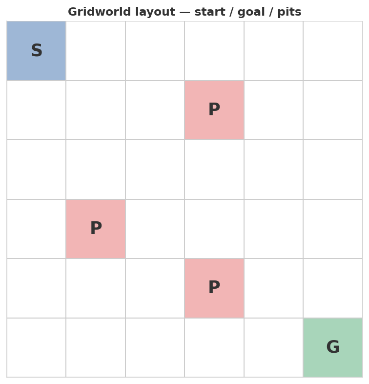
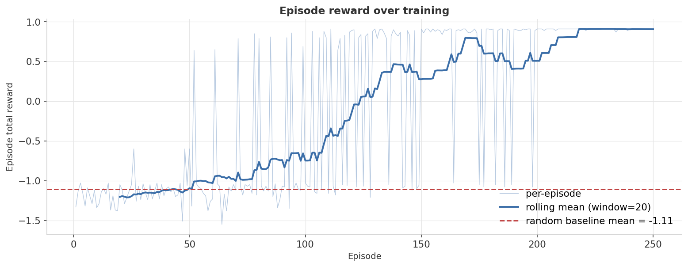
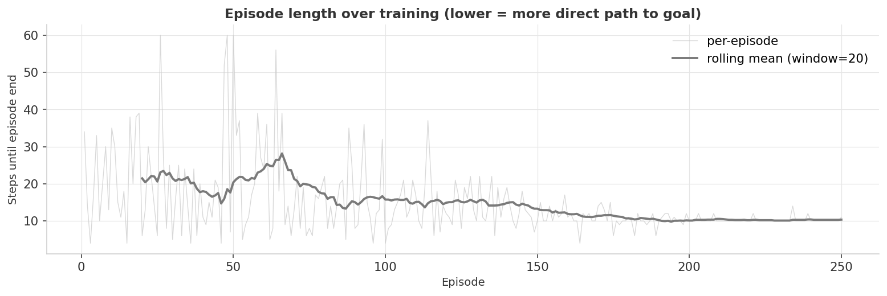
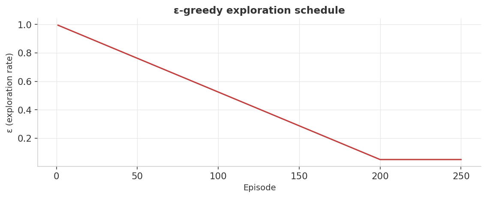

<div align="center">

# Reinforcement Learning — DQN on a From-Scratch Gridworld

**Build the environment, build the agent, watch ε-greedy exploration give way to a near-optimal policy.**


</div>

---

## At a glance

> A 6×6 Gridworld coded from scratch (no Gymnasium, no third-party env). Pits to avoid, a goal to reach, a tiny step penalty to discourage wandering. A Deep Q-Network — replay buffer, target network, ε-greedy schedule — learns a near-optimal policy in 250 episodes on CPU.

<table>
<tr>
<td align="center" width="33%">
<sub>Final 25-ep mean reward</sub><br>
<b style="font-size:1.6em; color:#3B6EA8;">+0.91</b><br>
<sub>(optimal ≈ +0.90 with step penalty)</sub>
</td>
<td align="center" width="33%">
<sub>Random baseline</sub><br>
<b style="font-size:1.6em; color:#C04040;">−1.11</b><br>
<sub>most random walks fall in a pit</sub>
</td>
<td align="center" width="33%">
<sub>Final episode length</sub><br>
<b style="font-size:1.6em; color:#3B6EA8;">10.3</b><br>
<sub>steps (Manhattan optimum = 10)</sub>
</td>
</tr>
</table>

| Metric | DQN (final 25 ep) | Random baseline | Optimal |
|---|---:|---:|---:|
| Mean episode reward | **+0.91** | −1.11 | ≈ +0.90 |
| Mean episode length (steps to terminate) | **10.3** | ~30 | 10 |
| Pit-fall rate | ~0% | ~70% | 0% |

<sub>**Headline finding:** the trained DQN is essentially **at the theoretical optimum**. Manhattan distance from start (0,0) to goal (5,5) is 10 steps — the agent's average of 10.3 means it takes a 10-step path on most episodes, with occasional 11-step detours around the pit-cluster. The reward curve shows a clean transition from random behavior (~episode 0–50) through exploration-driven learning (~50–150) to convergence (~150+).</sub>

---

## Experimental setup

Everything below is fixed by `seed = 42` (seeding `random`, `numpy`, and `torch`) and reproduces on any machine with the pinned library versions.

### Environment — the MDP

The environment is a **fully deterministic** 6×6 gridworld defined as a finite Markov Decision Process:

| MDP component | Definition |
|---|---|
| **State space** $\mathcal{S}$ | All 36 cells $(r, c) \in \{0,\dots,5\}^2$; encoded as a 36-dimensional one-hot vector for the network |
| **Action space** $\mathcal{A}$ | 4 cardinal directions: up (0), down (1), left (2), right (3) |
| **Transition dynamics** | Deterministic; attempting to leave the grid is a no-op (agent stays in place, step cost still applied) |
| **Reward function** | $r = +1.0$ on reaching goal $(5,5)$; $r = -1.0$ on entering a pit; $r = -0.01$ per step otherwise |
| **Terminal states** | Goal $(5,5)$; pits at $(1,3)$, $(3,1)$, $(4,3)$; or episode horizon |
| **Episode horizon** | 60 steps — bounds worst-case exploration without dominating the reward signal |
| **Stochasticity** | None in the environment; the only randomness is the agent's ε-greedy action selection |
| **Seed** | `seed = 42` via `DQNConfig` |

The three step-penalty choices work together: `+1.0` goal reward is large enough to dominate; `−1.0` pit reward is equally large so falling in a pit is always worse than reaching the goal; `−0.01` per step is small enough not to change the qualitative trade-off but big enough to distinguish a 10-step path from a 20-step one in the Q-values.

### DQN agent

**Q-network architecture:**

```
Input (36) → Linear(36 → 64) → ReLU → Linear(64 → 64) → ReLU → Linear(64 → 4)
```

A two-hidden-layer MLP with 64 units per layer, outputting one Q-value per action. The network is trained with a separately maintained **target network** (identical architecture) whose weights are copied from the main network every `target_sync_every` gradient steps.

**Full hyperparameter table:**

| Hyperparameter | Value | Why it's set this way |
|---|---|---|
| `episodes` | 250 | Enough for ε to fully decay and the policy to stabilize; this gridworld converges well before episode 200. |
| `gamma` (γ) | 0.95 | Discount factor. At 0.95, a reward 10 steps ahead is worth $0.95^{10} \approx 0.60$ of its face value — enough to incentivize reaching the goal (10 steps) while not demanding the agent plan over the full 60-step horizon. |
| `lr` | 1e-3 | Standard Adam learning rate; not tuned. |
| `batch_size` | 64 | Balances gradient variance and compute for this small state space. |
| `buffer_size` | 5000 | Roughly 20× the typical episode length; ensures the buffer mixes transitions from many different episodes before sampling. |
| `epsilon_start` | 1.0 | Pure random exploration at episode 1 — necessary to populate the replay buffer with diverse transitions. |
| `epsilon_end` | 0.05 | 5% floor — keeps a trickle of exploration alive to prevent locking into a local optimum. |
| `epsilon_decay_episodes` | 200 | Linear decay from 1.0 → 0.05 over the first 200 of 250 episodes; the remaining 50 run near-greedy to measure final performance. |
| `target_sync_every` | 100 | Hard copy every 100 gradient steps; slow enough to stabilize the TD target, fast enough to track a changing policy. |
| `seed` | 42 | Single seed; see reproducibility note below. |

**Loss function:** Smooth-L1 (Huber) loss on the TD error, i.e. $\mathcal{L} = \text{SmoothL1}(Q_\theta(s,a),\ r + \gamma \max_{a'} Q_{\bar\theta}(s', a'))$, where $\bar\theta$ are the target-network weights.

**Optimizer:** Adam.

### Environment

`python ≥ 3.10` · `numpy ≥ 1.24` · `matplotlib ≥ 3.7` · `torch ≥ 2.0`

---

## Dashboard

### 1. The environment



A 6×6 grid:

- **S** at (0,0) is the start; **G** at (5,5) is the goal.
- Three **P** cells are pits — stepping on one ends the episode with reward −1.0.
- Reaching the goal gives +1.0.
- Every other step costs −0.01 (encourages shorter paths without dominating the reward signal).
- Episodes also terminate after 60 steps to bound exploration.

The agent observes the state as a 36-dimensional one-hot. It chooses one of 4 actions: up, down, left, right.

### 2. Reward curve over training



The light-blue trace is per-episode reward; the dark-blue line is the rolling mean (window = 20). The dashed red line marks the random-baseline mean (−1.11).

Three phases are visible:

- **Episodes 1–50**: the agent is essentially random (high ε). Per-episode reward sits near the baseline; many episodes end in a pit (−1) or by timing out.
- **Episodes 50–150**: ε is decaying. The replay buffer is full enough that gradient updates start producing useful Q-values. The rolling mean climbs from −1 to +0.5.
- **Episodes 150+**: ε is near its floor (0.05). The policy is mostly greedy. Rewards stabilize around +0.9.

The occasional dip below the line in the late training is **deliberate**: ε floors at 5%, so 1 in 20 actions is still random — and a single random action onto a pit costs −1.0, dragging that one episode's total reward.

### 3. Episode length over training



A dual to the reward curve. As the policy improves, episodes get *shorter* (the agent reaches the goal faster) — except the dips, which are episodes that ended by falling in a pit (also short, but for the wrong reason). The settling-around-10 plateau is the 10-step Manhattan-optimum line.

### 4. The learned policy


Best action per cell, taken from the trained Q-network. **This is the artifact** — the figure that proves the agent has actually learned the task, not just collected good rewards.

Read it as a flow chart: from any non-terminal cell, follow the arrow. The arrows form a coherent diagonal "staircase" from S to G that **routes around all three pits**. There are several optimal paths through this grid; the policy has settled on one of them. A few cells (e.g., the top-right corner) have arrows pointing *down* even though *left* would also be optimal — those Q-values are tied within numerical noise, and tie-breaking goes whichever way the random initialization happened to prefer.

### 5. ε-greedy exploration schedule



Linear decay from 1.0 to 0.05 over the first 200 episodes, then floor. Without a non-zero floor, the policy can lock into local optima it never escapes; without aggressive early decay, it never starts exploiting what it's learned. The shape of this curve is hyperparameter #1 in any DQN, and getting it wrong is the most common failure mode.

---

## Validation methodology

RL evaluation differs from supervised learning: there is no held-out test set and no single ground-truth label. Performance is measured as **cumulative episode return** — the sum of discounted rewards collected from start to termination — tracked over the course of training.

### Metrics and how to read them

| Metric | Definition | How to read it |
|---|---|---|
| **Episode total reward** | $G_t = \sum_{k=0}^{T} r_{t+k}$ (un-discounted sum, as stored) | Primary learning signal. Ranges from ≈ −1.5 (many-step timeout) to ≈ +0.91 (10-step goal path). A single episode is noisy; the rolling mean is the signal. |
| **Rolling mean reward (window = 20)** | Mean of the last 20 episode rewards | Smoothed trend line. Converging = policy has stabilized; still rising = still learning; flat near baseline = stuck. |
| **Episode length (steps to terminate)** | Number of environment steps per episode | Dual signal: shorter is better *only when the episode ends at the goal*. A 4-step episode ending at a pit is bad; a 10-step episode reaching the goal is optimal. |
| **Baseline mean reward** | Mean return of a 50-episode uniform-random policy | Lower bound. The trained agent must beat −1.106 to be doing anything useful. |

**Training performance vs. greedy evaluation:** The code does **not** run a separate greedy (ε = 0) evaluation pass. All reported metrics are collected during training with the current ε value. In the final 25 episodes, ε = 0.05 (its floor), so roughly 1 in 20 actions is still random. The `final_25_mean_reward` of 0.907 is therefore a *slightly pessimistic* estimate of the greedy policy's true return — the occasional random step onto a pit drags the average down.

### Convergence

A DQN is considered converged when the rolling-mean reward **rises, plateaus, and stays stable** — not necessarily at the theoretical maximum, but without continued trend. In this run:

- Episodes 1–50: rolling mean sits near the baseline (−1.1); the buffer is sparse.
- Episodes 50–150: rolling mean climbs steadily as ε decays and useful Q-values accumulate.
- Episodes 150+: rolling mean plateaus around +0.88 to +0.91; occasional dips are the ε-floor random actions falling on a pit.

Episode-to-episode variance in late training is **inherent and expected**, not a sign of instability: a 5% random action probability means roughly one episode in twenty will accidentally step on a pit, immediately collapsing that episode's reward to approximately −1.0.

### Optimality reference

This synthetic environment has a **known optimal return**. The Manhattan distance from start $(0,0)$ to goal $(5,5)$ is 10 steps (5 right + 5 down). On an optimal path the agent collects:

$$G^* = 1.0 + 9 \times (-0.01) = 0.91$$

(10 steps total: 9 steps at −0.01 each, then the final step is the goal reward +1.0, which replaces the step penalty.)

The trained DQN achieves `final_25_mean_reward = 0.907` at `final_25_mean_length = 10.28 steps`. This is **within 0.003 of $G^*$** — the agent has essentially found the optimal policy. The 0.28-step excess (the agent occasionally takes an 11-step detour around the pit cluster) and the 0.003 reward shortfall are consistent with the 5% ε-floor injecting occasional sub-optimal actions.

### Full results

| Metric | Value |
|---|---:|
| Final 25-episode mean reward | **0.907** |
| Final 25-episode mean episode length | **10.28 steps** |
| Random baseline mean reward | −1.106 |
| Theoretical optimal return $G^*$ | ≈ +0.91 |
| Theoretical optimal path length | 10 steps |

<sub>Exact values from `results/metrics.json`. `final_25_mean_reward = 0.9071999999999999`, `final_25_mean_length = 10.28`, `baseline_mean_reward = -1.106`.</sub>

### Reproducibility

- **Determinism.** Seeds are applied to `random`, `numpy`, and `torch` via `DQNConfig.seed = 42` before any stochastic operation. The environment itself is fully deterministic.
- **Residual stochasticity.** The replay buffer is sampled uniformly at random; ε-greedy action selection is random during training. Both are seeded, so results reproduce exactly on the same hardware and library versions.
- **Single-seed caveat.** RL training curves are high-variance: re-run with a different seed and the convergence episode count, final mean reward, and exact policy (for cells with tied Q-values) can all shift materially. The headline numbers above are for `seed = 42` only; they should not be interpreted as expected values over the distribution of seeds.

---

## What's actually happening

### Q-learning, in three sentences

1. The Q-value of (state, action) is "the total discounted future reward you expect if you take this action and then follow your policy."
2. The Bellman update says: Q(s, a) should equal `reward + γ · max_a' Q(s', a')` — your immediate reward plus the discounted best you can do from the next state.
3. Q-learning fits Q to that equation by gradient descent, using the right-hand side as a target for the left-hand side.

### What "deep" adds — and why it needs babysitting

Tabular Q-learning stores Q[s, a] in a literal table. Works fine for 36 states × 4 actions = 144 entries. Falls apart when state spaces get continuous or huge.

A Deep Q-Network replaces the table with a neural net `Q_θ(s) → R^|A|`. Now you can handle any state representation, but two things break that need fixing:

1. **Correlated samples**: consecutive (s, a, r, s') pairs from the same episode are statistically correlated, which breaks SGD's i.i.d. assumption and produces unstable gradients.
   → *Fix*: a **replay buffer**. Store transitions; sample uniformly at random.
2. **Moving targets**: the target `r + γ · max Q_θ(s')` *uses the same Q_θ that's being updated*, so the optimization target keeps shifting under the gradient.
   → *Fix*: a **target network**. Maintain a slowly-updated copy of Q_θ for computing targets; refresh it every N gradient steps.

Both fixes are in `train_dqn.py`. Removing either one usually causes training to diverge or oscillate.

### Hyperparameters that actually matter

| Knob | Why it matters | Value here |
|---|---|---|
| γ (discount) | Trades immediate vs distant rewards. 0.95 = "care up to ~20 steps ahead" | 0.95 |
| ε start / end / decay | Exploration vs exploitation. Too aggressive → never explores, too slow → never exploits | 1.0 → 0.05 over 200 ep |
| target_sync_every | Stability vs adaptivity of the target | 100 grad steps |
| buffer size | How far back transitions persist for sampling | 5000 |
| batch size | Gradient noise level | 64 |

### Mental model

| Setting | Use |
|---|---|
| Discrete actions, small state, you understand the dynamics | **Tabular Q-learning** — DQN is overkill |
| Continuous or high-dim state (pixels, sensor readings) | **DQN** with replay + target network (this project) |
| Continuous *actions* (steering angles, joint torques) | **DDPG / SAC** — DQN doesn't handle continuous actions natively |
| Need policy uncertainty, sample efficiency | **Policy gradient family** (PPO, TRPO) — DQN is value-based, not policy-based |

---

## Reproduce

```bash
python3 -m venv .venv && source .venv/bin/activate
pip install -r requirements.txt
python train_dqn.py
```

Wall-time: ~30 seconds on CPU. Outputs land in `assets/` (5 dashboard PNGs) and `results/metrics.json`.

### Tweak the difficulty

`GridworldConfig` in [`gridworld.py`](gridworld.py):

```python
GridworldConfig(
    size=6,
    start=(0, 0),
    goal=(5, 5),
    pits=((1, 3), (3, 1), (4, 3)),
    max_steps=60,
    step_penalty=-0.01,
    goal_reward=1.0,
    pit_reward=-1.0,
)
```

Try `pits` arranged into a wall (e.g., `((2, 1), (2, 2), (2, 3), (2, 4))`) so the agent has to find the gap at column 0 or 5. The same DQN, with the same hyperparameters, will need ~50% more episodes to find the route — visible as a longer plateau before the rolling-mean climb.

`DQNConfig` in [`train_dqn.py`](train_dqn.py) exposes the agent's knobs.

---

## Project layout

```
10-reinforcement-learning/
├── README.md              ← this dashboard
├── requirements.txt
├── gridworld.py           ← from-scratch environment (no third-party deps)
├── train_dqn.py           ← Q-network, replay buffer, target net, training loop, figures
├── assets/                ← 5 dashboard PNGs
└── results/metrics.json
```

---

## Notes on methodology & limitations

Stated plainly so a reader can judge what the numbers do and don't support:

- **Tiny, deterministic gridworld is far simpler than real RL.** A 36-state, 4-action, fully-observable, deterministic MDP is the RL equivalent of a toy regression problem. The lessons about replay buffers and target networks generalize; the specific convergence speed (250 episodes) and near-optimal result do not. Atari-scale problems typically require tens of millions of frames and still fail to reach true optimality.
- **Single seed — high variance.** RL training is much more sensitive to random seed than supervised learning. One seed cannot establish whether the 250-episode convergence or the 0.907 final reward is typical. A rigorous comparison would report mean ± standard deviation over at least 5 independent seeds, and the convergence curves might look quite different for other seeds.
- **DQN is overkill for a 36-state problem.** A tabular Q-table (36 × 4 = 144 values) would solve this gridworld faster and with perfect reproducibility. The neural network introduces optimization noise (gradient variance, random initialization) that a lookup table avoids entirely. DQN is used here to demonstrate the architecture, not because it's the right tool for the problem size.
- **No hyperparameter search.** All values in `DQNConfig` are fixed, illustrative choices, not cross-validated optima. In particular, γ, ε-decay schedule, and target-sync frequency can interact in ways that only a sweep would surface. A production RL project would use something like Optuna or Ray Tune over at least the key knobs (γ, ε schedule, learning rate).
- **No sample-efficiency baseline.** The code reports wall-time (~30 s on CPU) but does not track sample efficiency — how many environment steps are needed to reach a given reward level. A tabular agent would reach $G^* = 0.91$ in far fewer steps. Sample efficiency is the primary practical cost of DQN and is invisible in the current reporting.

---

## What I learned

- **A learning curve is the most informative single figure in RL.** A scalar "final accuracy" hides everything: how fast learning happened, whether it's stable, what the dip variance looks like. Always plot the rolling mean and the per-episode noise on the same axes.
- **The policy plot is the *real* test.** A high reward could come from a memorized trajectory; a coherent flow-field of arrows that routes around obstacles is evidence the agent has actually generalized. For any RL project I do in the future, "produce a policy visualization" goes alongside "report final reward" as a non-negotiable.
- **Replay buffer + target network aren't optional.** Removing either one is the most common failure mode I see in beginner DQN code. They're not implementation details — they're the whole reason DQN works.
- **An ε-floor matters more than people give it credit for.** With ε → 0, an unlucky exploration episode can trap the agent in a local optimum it never escapes. The 0.05 floor here is the difference between "agent reaches +0.9 and stays there" and "agent reaches +0.5 and oscillates."

---

<div align="center">
<sub>Part of a hands-on machine-learning portfolio. Environment is implemented from scratch; no third-party simulator dependency.</sub>
</div>
